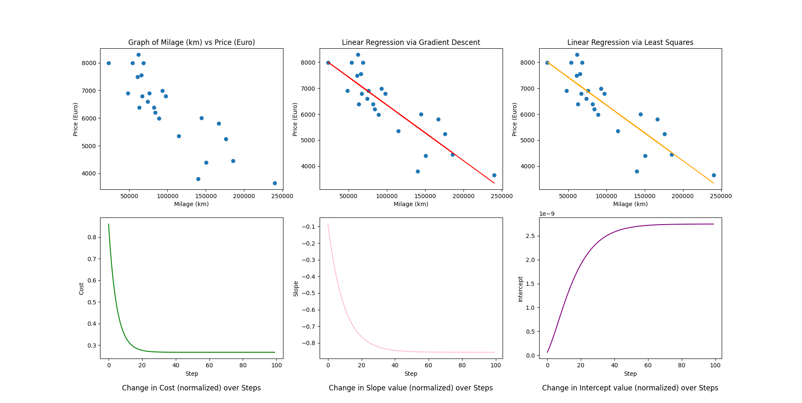

# 42KL-ft_linear_regression
An introductory project to machine learning, where gradient descent is used to produce a linear regression for the purpose of predicting the price of a car.

## Dependencies

All dependencies are listed [here](./requirements.txt).

## Installation

1. `git clone https://github.com/LaiAnTan/42KL-ft_linear_regression`
2. `pip install -r requirements.txt` or in other environments such as conda

## Usage

`python main.py <command> <--args>`

For help, specify `-h` after main.py for general help or after commands for specific command help.

## Notes

Notes for the project can be found [here](https://hackmd.io/G_d-vmH9Sk6nm5d0XXdzpw?both).
